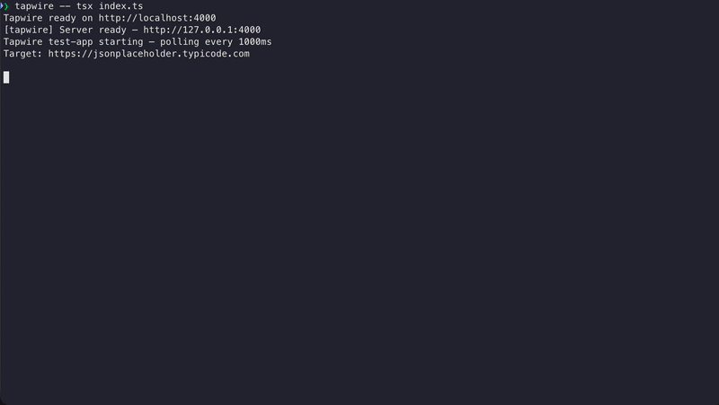

# Tapwire

**The Chrome DevTools Network tab for your Node.js APIs.**

*WIP — early release. Core workflow is functional, rough edges expected.*



Tapwire intercepts every outbound HTTP call your service makes, shows it in a live web UI, and lets you turn real traffic into reusable mocks — without changing a single line of code.

```bash
npx tapwire -- node src/index.js
```

Your app runs normally. Every HTTP call appears in the dashboard at `http://localhost:4000`. When you see a request you want to mock, click **Promote** — Tapwire saves it as a fixture, and from that point on it replays the captured response instead of hitting the real server.

## Why Tapwire?

Every mock tool assumes you already know what to mock. Tapwire assumes you don't.

- **Onboarding onto an unfamiliar codebase?** See exactly which APIs it calls before you write a single mock.
- **No access to dependent services?** Capture real traffic once, replay it forever locally.
- **Tired of writing mocks by hand?** Tapwire builds them from real responses — correct by default.

## How it works

```
Your app makes an HTTP call
        │
Tapwire intercepts it transparently (via @mswjs/interceptors)
        │
Request forwarded to the real server
        │
Request + response captured in memory
        │
Appears in the live UI feed
        │
You promote it to a stub (optional)
        │
Next time: served from the fixture, real server never contacted
```

Tapwire runs as a single CLI command that orchestrates two processes:

1. **Your app** — with Tapwire's HTTP interceptor injected via `--require` before your code loads
2. **Tapwire server** — holds all state, serves the REST API and the web UI

The interceptor patches `http`, `https`, `fetch`, and `undici` at the Node.js level using [@mswjs/interceptors](https://github.com/mswjs/interceptors). Resolution happens over localhost — your app never knows it's being observed.

## Quick start

### With npx (no install)

```bash
npx tapwire -- node src/index.js
```

### Installed in your project

```bash
npm install --save-dev tapwire
```

Add a script to `package.json`:

```json
{
  "scripts": {
    "dev": "tapwire -- node src/index.js",
    "dev:mock": "tapwire --mode mock -- node src/index.js"
  }
}
```

Works with any Node.js runner:

```bash
tapwire -- tsx src/index.ts
tapwire -- npx nodemon src/index.js
```

## CLI options

```
tapwire [options] -- <command>

Options:
  --port <n>         Server port (default: 4000)
  --fixtures <path>  Fixtures directory (default: .tapwire/fixtures)
  --mode <mode>      Server mode: default, mock, proxy, record (default: default)
```

Environment variables `TAPWIRE_PORT` and `TAPWIRE_FIXTURES_DIR` can also be used to set port and fixtures path.

## Features

### Transparent interception

Captures outbound HTTP calls from `http`, `https`, `fetch`, and `undici` — no code changes, no proxy configuration. Call stack frames are captured so you can see exactly where each request originates.

### Live web UI

Real-time request feed via Server-Sent Events. Inspect full request/response detail including headers, body, latency, and initiator stack trace. Promote captures to stubs directly from the browser.

### Pattern matching with specificity

Stubs use Express-style route patterns (`/users/:id`) and match on method + host + pathname. When multiple patterns match, the most specific one wins — `/users/me` always beats `/users/:id`.

### Server modes

The `--mode` flag sets a global override for how all matched requests are handled:

| Mode | Behaviour |
|------|-----------|
| `default` | Each stub's own mode is respected |
| `mock` | All matched stubs serve mock responses |
| `proxy` | All matched stubs forward to the real server |
| `record` | All matched stubs forward and capture the response |

In `mock` or `record` mode, enabling **strict mode** via the settings API rejects unmatched requests with `501` instead of letting them pass through.

### Per-stub configuration

Each stub can be independently configured at runtime:

- **Stub mode**: mock / proxy / record
- **Response mode**: fixed (always the same response), sequential (cycle through), random
- **Failure injection**: set a failure rate (0–100%) to randomly serve from the faults pool
- **Latency simulation**: add artificial delay (ms) to responses
- **Forced status code**: override the response status
- **Network error simulation**: connection reset, timeout, DNS failure, connection refused, connection aborted

### Committable fixtures

Fixtures are human-readable JSON files in `.tapwire/fixtures/`. Commit them to git — one developer's capture work becomes the whole team's mock library.

### Automatic header scrubbing

When a capture is promoted to a stub, sensitive headers (`authorization`, `cookie`, `set-cookie`, `x-api-key`, `x-auth-token`, `x-session-token`) are automatically replaced with `[REDACTED]`. Raw traffic in the UI always shows full detail.

## Fixture format

Promoted stubs are stored as individual JSON files:

```json
{
  "id": "550e8400-e29b-41d4-a716-446655440000",
  "method": "GET",
  "host": "api.example.com",
  "pattern": "/users/:id",
  "mode": "mock",
  "config": {
    "failureRate": 0
  },
  "responses": {
    "mode": "sequential",
    "cursor": -1,
    "responses": [
      {
        "id": "a1b2c3",
        "statusCode": 200,
        "body": { "id": 1, "name": "Jane Doe" },
        "headers": { "content-type": "application/json" },
        "capturedAt": "2026-01-15T14:32:00Z",
        "host": "api.example.com"
      }
    ]
  },
  "faults": {
    "mode": "fixed",
    "cursor": -1,
    "responses": [
      {
        "id": "d4e5f6",
        "statusCode": 500,
        "body": { "message": "Internal Server Error" },
        "headers": { "content-type": "application/json" }
      }
    ]
  }
}
```

Add multiple responses to the `responses` pool and set `mode: "sequential"` to cycle through them. Set `failureRate: 30` to inject errors 30% of the time from the `faults` pool.

## REST API

Tapwire exposes a full REST API at `http://localhost:4000` for managing captures, stubs, responses, and server settings. Everything the web UI does is available programmatically.

## Requirements

- Node.js >= 18.0.0

## License

MIT
